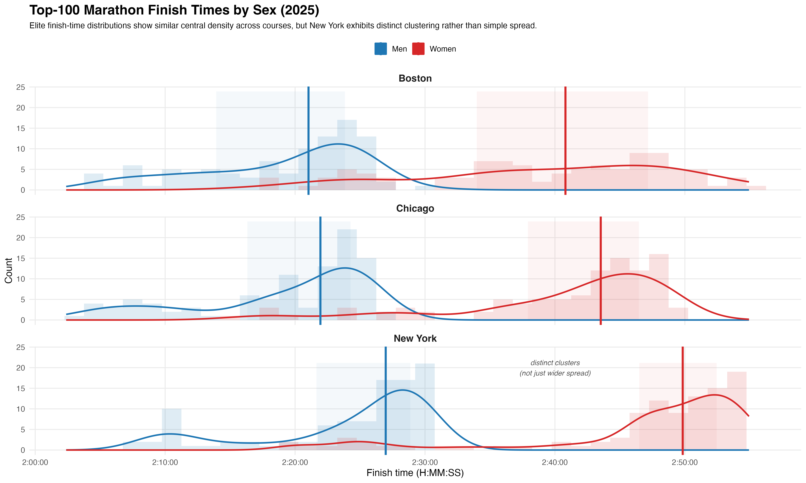
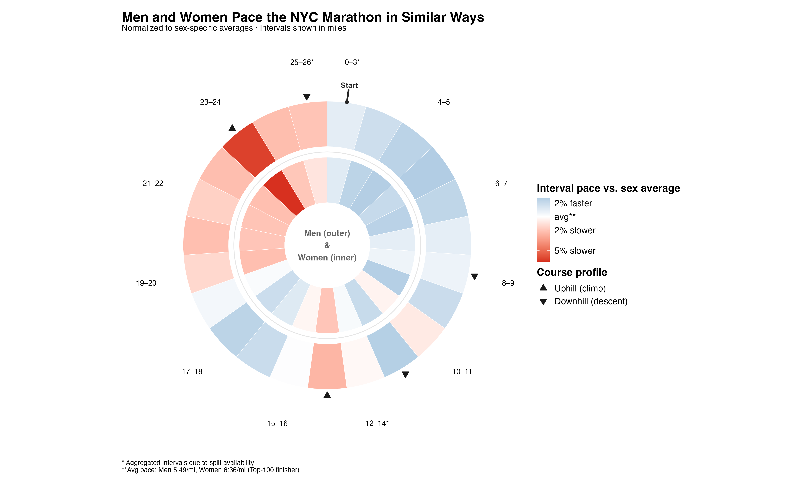

# Marathon pacing & finish-time distributions (Top-100)

This repository reproduces two data visualizations based on publicly available marathon result data:

1. **Top-100 finish-time distributions by sex** across Boston, Chicago, and New York  
2. **NYC Marathon pacing profile** (polar heatmap), showing relative pace deviations along the course for men (outer ring) and women (inner ring)

All figures are generated from scratch using the included Excel files to ensure full reproducibility.

---

## Quick start (Binder — runs in the browser)

1. Click the **Binder badge** at the top of this page.
2. Binder will launch an RStudio session in your browser.
3. In the **Files** pane, open `analysis.R`.
4. Run the entire code at once.

The script reproduces both figures and writes them to the `output/` directory.

> Note: The first Binder launch may take a few minutes while required packages are installed.

---

## Run locally

### Requirements
- R (≥ 4.3 recommended)
- The packages listed below

### Install required packages

    install.packages(
      c("readxl","dplyr","janitor","ggplot2","stringr","scales","tidyr"),
      repos = "https://cloud.r-project.org"
    )

### Run the analysis

1. Open `analysis.R` in RStudio.
2. Set the correct working directory.
3. Run the entire script (e.g., using **Source**).

All figures will be generated automatically in the `output/` directory.

---

## Repository structure

- `analysis.R` — full analysis pipeline (data preparation + both plots)
- `data_raw/` — original Excel files (public sources; included for reproducibility)
- `output/` — rendered figures
- `binder/` — Binder configuration (`runtime.txt`, `install.R`)

---

## Figures

### Top-100 finish-time distributions

### NYC Marathon pace deviations (polar heatmap)

---

## Data sources

The input files in `data_raw/` were obtained from publicly available marathon result websites:
- New York City Marathon (Top-100 men and women)
- Chicago Marathon (Top-100 men and women)
- Boston Marathon (Top-100 men and women)

The original Excel files are included in this repository to ensure reproducibility and ease of grading.

---

## AI disclosure

ChatGPT was used as a coding assistant for specific data-preparation tasks (e.g., handling Excel time formats, parsing split times, and scaling density curves to align with histogram counts).  
All visualization design choices, analytical decisions, and interpretations were developed and finalized by the authors: Nicolai Wittke, Florian Kübe, Julia Klauck,  Polimnia Tsiafaki.
